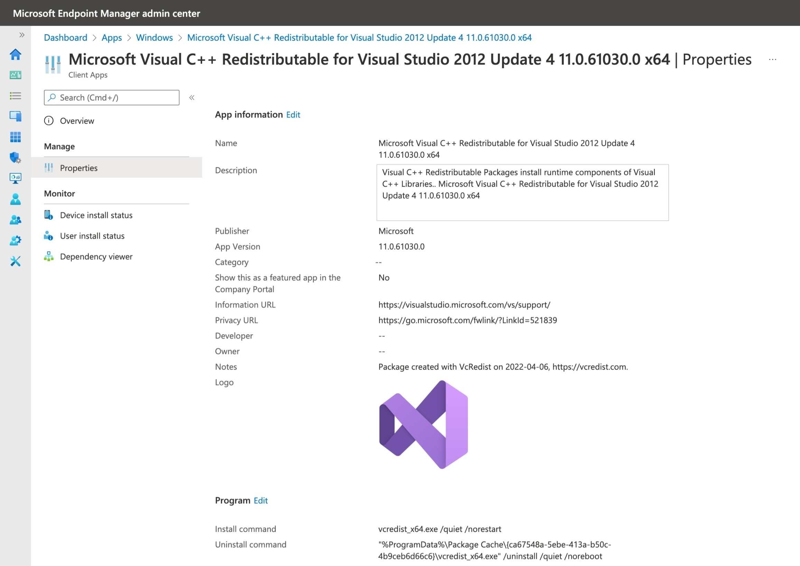

# Import Redistributables into Microsoft Intune

`Import-VcIntuneApplication` automates packaging and importing Visual C++ Redistributables as Win32 applications into Microsoft Intune. Each redistributable is packaged, assigned detection and requirement rules, and imported as a separate application.

**Key features:**
- Packages each Visual C++ Redistributable as a .intunewin file
- Sets application properties: Name, Description, Publisher, Version, URLs, Notes, Logo, Install/Uninstall commands, Install behavior, OS architecture, minimum OS, detection and requirement rules
- Skips import if the app already exists and is up-to-date in Intune
- Cleans up temporary files after import

> **Note:**
> - Requires the [IntuneWin32App](https://github.com/MSEndpointMgr/IntuneWin32App) PowerShell module
> - Supported only on Windows PowerShell (not PowerShell Core)
> - Authenticate to Intune with `Connect-MSIntuneGraph` before use
> - Requires a valid Microsoft Graph API access token

## Initial Setup

To import the Visual C++ Redistributables into Microsoft Intune, some initial setup is required - first, install the required modules from the PowerShell Gallery:

```powershell
Set-PSRepository -Name PSGallery -InstallationPolicy Trusted
Install-Module -Name VcRedist, IntuneWin32App, MSAL.PS
```

## Parameters

- `VcList` (**required**): An array of Visual C++ Redistributable objects, typically from `Save-VcRedist`. Each object must have required properties (see below).

## Prerequisites

1. **Install required modules:**

   ```powershell
   Set-PSRepository -Name PSGallery -InstallationPolicy Trusted
   Install-Module -Name VcRedist, IntuneWin32App, MSAL.PS
   ```

2. **Authenticate to Intune:**

   ```powershell
   Connect-MSIntuneGraph -TenantID contoso.onmicrosoft.com
   ```

   For non-interactive authentication, use an Entra ID app registration with `DeviceManagementApps.ReadWrite.All` permission:

   ```powershell
   Connect-MSIntuneGraph -TenantID contoso.onmicrosoft.com -ClientId "<appId>" -ClientSecret <secret>
   ```

3. **Ensure the IntuneWin32App module is available and a valid Microsoft Graph API access token is present.**

## Required VcList Properties

Each object in `VcList` must include:

- `Name`, `Version`, `Path`, `Architecture`, `SilentInstall`, `SilentUninstall`, `PackageId`, `URI`, and other properties as produced by `Save-VcRedist`.

The function will validate these properties and throw if any are missing.

## Authentication

### Non-interactive Authentication

An Entra ID app registration can be used for non-interactive authentication. The app registration requires the **DeviceManagementApps.ReadWrite.All** application permission. Create an app registration, assign the permission and enable admin consent. Then use a client secret or client certificate to use with authentication.


For a non-interactive sign-in that uses the app registration and a client secret, use this example:

```powershell
Connect-MSIntuneGraph -TenantID contoso.onmicrosoft.com -ClientId "f99877d5-f757-438e-b12b-d905b00ea6f3" -ClientSecret <secret>
```

## Example: Import Redistributables

The following example retrieves the list of Visual C++ Redistributables for the 2022 release, downloads the installers, and imports each as a Win32 app into Intune:

```powershell
$VcList = Get-VcList -Release "2022" | Save-VcRedist -Path C:\Temp\VcRedist
Import-VcIntuneApplication -VcList $VcList
```




## Assign Applications

After import, assign the applications using `Add-IntuneWin32AppAssignmentAllDevices`. The function returns application objects with an `Id` property:

```powershell
$Apps = Get-VcList | Save-VcRedist -Path C:\Temp\VcRedist | Import-VcIntuneApplication
foreach ($App in $Apps) {
    $params = @{
        Id                           = $App.Id
        Intent                       = "required"
        Notification                  = "hideAll"
        DeliveryOptimizationPriority = "foreground"
        Verbose                      = $true
    }
    Add-IntuneWin32AppAssignmentAllDevices @params
}
```

## How It Works

1. **Validates prerequisites:**
   - Ensures running on Windows PowerShell (not Core)
   - Checks for IntuneWin32App module
   - Checks for Microsoft Graph API access token
2. **Loads the Intune app manifest** from `Intune.json` in the module directory
3. **Creates an icon object** if the icon file exists
4. **Validates each VcList object** for required properties
5. **Checks for existing Intune apps** and skips import if up-to-date
6. **Packages the installer** as a .intunewin file
7. **Creates requirement and detection rules** from the manifest and VcList
8. **Imports the app** using `Add-IntuneWin32App`
9. **Cleans up** temporary files

## Troubleshooting

- **PowerShell Core not supported:** The function will throw if run on PowerShell Core. Use Windows PowerShell 5.1.
- **Missing modules:** Ensure `IntuneWin32App` is installed and available in your session.
- **Authentication errors:** Authenticate with `Connect-MSIntuneGraph` and ensure `$Global:AccessToken` is set.
- **Missing required properties:** Use `Save-VcRedist` to generate a valid `VcList`.

## See Also

- [IntuneWin32App PowerShell Module](https://github.com/MSEndpointMgr/IntuneWin32App)
- [VcRedist Documentation](https://vcredist.com/)
