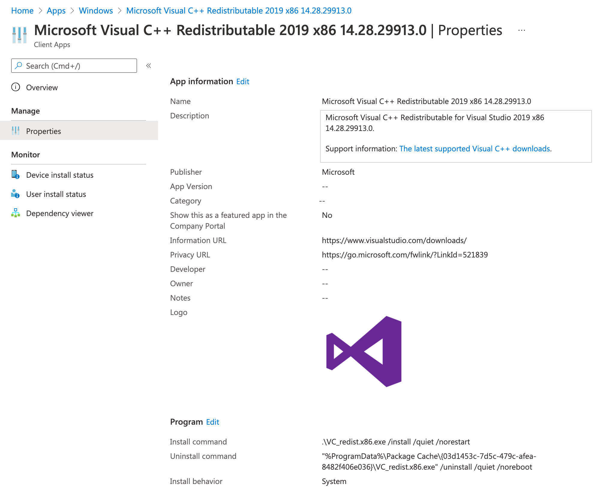

# Import Redistributables into Intune

VcRedist can be used to create new applications in Microsoft Intune for the Visual C++ Redistributables using the [IntuneWin32App](https://github.com/MSEndpointMgr/IntuneWin32App) module. This approach allows you to create Win32 applications for each of the Redistributables versions and processor architecture including importing new versions as they are available and superseding older versions for upgrades.


## Initial Setup

To import the Visual C++ Redistributables into Microsoft Intune, some initial setup is required - first, install the required modules from the PowerShell Gallery:

```powershell
Set-PSRepository -Name PSGallery -InstallationPolicy Trusted
Install-Module -Name VcRedist, IntuneWin32App, PSIntuneAuth, AzureAD
```

Download the [Visual C++ Redistributables](/save-vcredist.html) locally so that they can be wrapped with the [Microsoft Win32 Content Prep Tool](https://github.com/Microsoft/Microsoft-Win32-Content-Prep-Tool) before uploading into Intune.

```powershell
$Path = "C:\Temp\VcRedist"
$VcRedists = Get-VcList -Release 2012, 2013, 2019
Save-VcRedist -Path "$Path\Package" -VcList $VcRedists
```

Authenticate to Microsoft Intune tenant with `Connect-MSIntuneGraph`:

```powershell
Connect-MSIntuneGraph -TenantName stealthpuppylab.onmicrosoft.com -PromptBehavior Always
```

## Package the Redistributables

Note, that each of the code blocks below are wrapped individually in `ForEach ($VcRedist in $VcRedists)` for readability; so you'll need to wrap all of the final code in the `ForEach` loop.

Each of the Redistributables will need to be turned into a `intunewin` package with `IntuneWinAppUtil.exe`. This code will step through each Redistributable stored in the variable `$VcRedists` and generate a package:

```powershell
ForEach ($VcRedist in $VcRedists) {
    
    # Create variables for the package source and output folders
    $Package = [System.IO.Path]::Combine($Path, "Package", $VcRedist.Release, $VcRedist.Version, $VcRedist.Architecture)
    $Output = [System.IO.Path]::Combine($Path, "Output", $VcRedist.Release, $VcRedist.Version, $VcRedist.Architecture)
    New-Item -Path $Output -ItemType "Directory"

    # Find the Redistributable setup.exe
    $Installer = Split-Path -Path $VcRedist.URI

    # Wrap the installer
    Start-Process -FilePath "IntuneWinAppUtil.exe" -ArgumentList "-c $Package -s $Installer -o $Output -q" -Wait -NoNewWindow
}
```

## Create and Upload a Microsoft Intune application

Creating an application with the IntuneWin32App module involves several steps:

### Application icon

Although it's unlikely you'll make the Redistributables available in the Company Portal for end-users to install themselves, let's create an icon for that application for completeness with `New-IntuneWin32AppIcon`. The icon can be downloaded from the icon repository maintained here: [Insentra/intune-icons](https://github.com/Insentra/intune-icons).

```powershell
# Download the icon image and turn into an Intune application icon
$IconSource = "https://raw.githubusercontent.com/Insentra/intune-icons/main/icons/Microsoft-VisualStudio.png"
$ImageFile = "$Path\$(Split-Path -Path $IconSource)"
Invoke-WebRequest -Uri $IconSource -OutFile $ImageFile -UseBasicParsing
$Icon = New-IntuneWin32AppIcon -FilePath $ImageFile
```

### Application detection rule

Let's create a simple registry detection rule with `New-IntuneWin32AppDetectionRuleRegistry` for each application so that Intune can determine whether the Redistributable is installed or not. Each Redistributable record in the `$VcRedists` variable includes an `UninstallKey` property that lists whether the Uninstall key for the Redistributable is in the 32-bit or 64-bit Registry. Microsoft hasn't been terribly consistent in where the Uninstall information is stored for each Redistributable, this we can't use something as simple as the MSI ProductCode for detection.

```powershell
$KeyPath = "HKEY_LOCAL_MACHINE\SOFTWARE\Microsoft\Windows\CurrentVersion\Uninstall"
ForEach ($VcRedist in $VcRedists) {
    
    # Configure detection for each application
    # Enable 'Associated with a 32-bit app on 64-bit clients' as required
    $params = @{
        Existence            = $true
        KeyPath              = "$KeyPath\$($VcRedist.ProductCode)"
        Check32BitOn64System = If ($VcRedist.UninstallKey -eq "32") { $True } Else { $False }
        DetectionType        = "exists"
    }
    $DetectionRule = New-IntuneWin32AppDetectionRuleRegistry @params
}
```

### Application requirement rule

Hopefully no-one is still deploying to 32-bit Windows, but we'll configure the detection rules appropriately for each Redistributable architecture with `New-IntuneWin32AppRequirementRule`:

```powershell
ForEach ($VcRedist in $VcRedists) {
    Switch ($VcRedist.Architecture) {
        "x86" {
            $PackageArchitecture = "All"
        }
        "x64" {
            $PackageArchitecture = "x64"
        }
    }
    $params = @{
        Architecture                    = $PackageArchitecture
        MinimumSupportedOperatingSystem = "1607"
    }
    $RequirementRule = New-IntuneWin32AppRequirementRule @params
}
```

### Create the application with assignments

With the application icon, detection rule and requirement rule created, we can create an application for each Redistributable, with `Add-IntuneWin32App` and configure assignments with `Add-IntuneWin32AppAssignmentAllDevices`. VcRedist provides much of the detail required for the application properties for each Redistributable application - in the example below, the Redistributable will be assigned to all devices.

```powershell
$Publisher = "Microsoft"
ForEach ($VcRedist in $VcRedists) {
    $params = @{
        FilePath                 = $IntuneWinFile.FullName
        DisplayName              = "$Publisher Visual C++ Redistributable $($VcRedist.Release) $($VcRedist.Version) $($VcRedist.Architecture)"
        Description              = "$Publisher $($VcRedist.Name) $($VcRedist.Version) $($VcRedist.Architecture)."
        Publisher                = $Publisher
        InformationURL           = $VcRedist.URL
        PrivacyURL               = "https://go.microsoft.com/fwlink/?LinkId=521839"
        CompanyPortalFeaturedApp = $false
        InstallExperience        = "system"
        RestartBehavior          = "suppress"
        DetectionRule            = $DetectionRule
        RequirementRule          = $RequirementRule
        InstallCommandLine       = ".\$Installer $($VcRedist.SilentInstall)"
        UninstallCommandLine     = $VcRedist.SilentUninstall
        Icon                     = $Icon
        Verbose                  = $true
    }
    $App = Add-IntuneWin32App @params

    $params = @{
        Id                           = $App.Id
        Intent                       = "required"
        Notification                 = "hideAll"
        DeliveryOptimizationPriority = "foreground"
        Verbose                      = $true
    }
    Add-IntuneWin32AppAssignmentAllDevices @params
}
```

Once imported, the Redistributable applications should look similar to the following:


